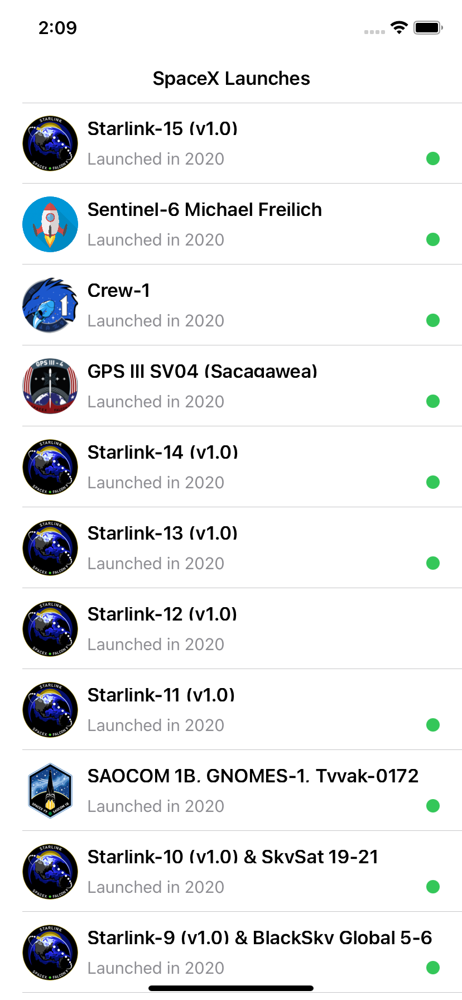
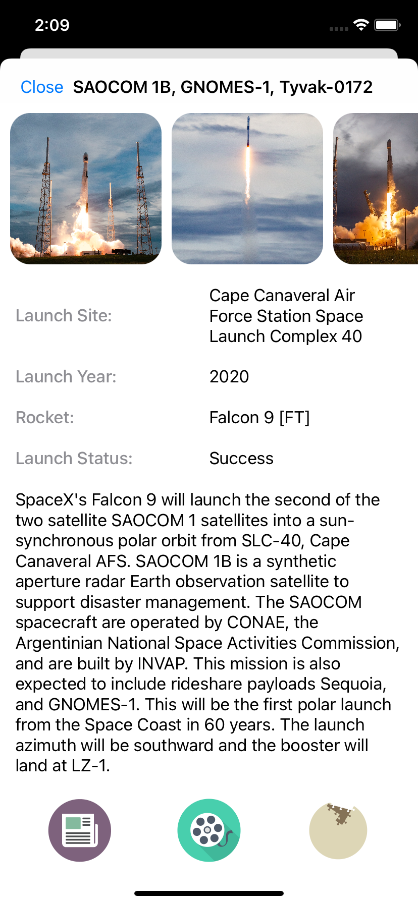

## Notes

This application uses the https://spacex.land/ an Grapql based api consumption. The application consits of Home screen and Details

### Date

December 6th 2021

### Instructions for how to build & run the app

1. Open the "SpaceX.xcodeproj" in Xcode
2. No Extra dependency needs to be downloaded as the dependency are mainted by SPM
3. Select a simulator and click on Run

### Time spent

6 Hours

### Assumptions made

1. The Home Screen is built as part of infnite scroll with pagination kicking in at 60% of scrolled content
2. Offline mode is enabled when the api either fails or due to internet connectivity issue
3. The image url through out Project is consider to be a working valid URL. A placehold image loading is inplace for edge cases
4. The project is localized to handle multi-language (French and English) for App based variables. Api Variables are fixed to English due to the limitation of the api
5. "launchesPast" api is used to define all the launches in the homescreen
6. "launch" api is used to open a specific launch through deep link
7. Pull Down to refresh is implemented on the Home screen

### Assume your application will go into production...

1. The App Architecture user is MVVM., Which makes it easier to extend it on performing Unit test.
2. The SpaceX API's are open ended and the ratelimiting is done based on User's IP. There is no bottle neck with this implementation and can scale up to any number of users. However if there is a limitation is later enforced based on a "ApiKey". One of the follwoing approaches can be taken

- Build a backend based an Api layer which will consume from "spaceX" and cache the records with periodic updates. The users will hit the middle layer from the mobile app, Thus enabaling a scalable approach
- Enable a user registration/authorization flow and tieing up user session with individual api key's

3. Would Consider implementing a SSL Pinning and TLS rules to ensure security. Based on Feature roadmap, Tieing the user with a onboarding flow (registeration and login) to restrict open access. Saving user senitive information in the keychain for secuing it

### Shortcuts/Compromises made

1. Defining a app store image
2. Would have consided building a search functionality on the home screen
3. Would have add better encapsulation on certain feature ( Localization and Image Loading)
4. Enabling a Video player embedded in the app rather than external links
5. More extensive and details on launches could have been added

### Why did you choose the specific technology/patterns/libraries?

Built the application in a MVVM architecture, Keeping scalability and better code structure in mind. Also incoporated the Facade,Decorator and Adapter Patterns.

Third Party Libraries User
Apollo - To make Graphql Api connection
Kingfisher - Used to better process and server images in the application
SqlLite - Used for caching and persisting data for offline mode

### Stretch goals attempted

1. Offline Mode Implemented as part of the GraphQl SDK (apollo) With a local SQLite database
2. Navigator 2.0 is not related for Native IOS Build
3. Deeplinking is enabled as URL schemes. Type the following in safari "spacex://launch=1" The launch param will accept any number value and open the related details screen

### Other information about your submission that you feel it's important that we know.
